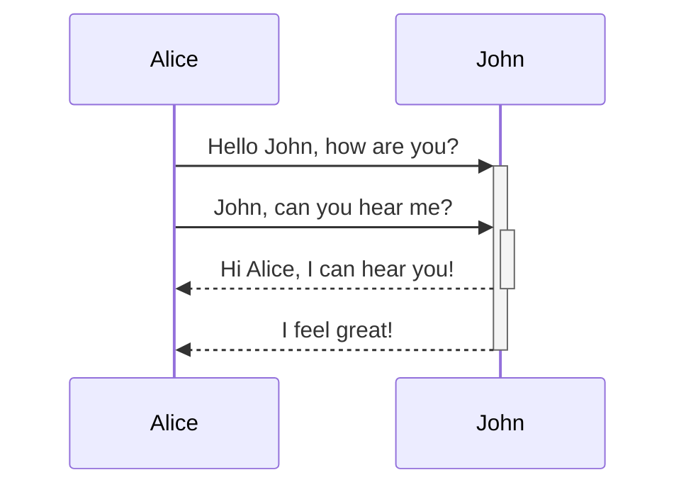

---
{"dg-publish":true,"permalink":"/openbox/home/","tags":"gardenEntry","dgHomeLink":true,"dgPassFrontmatter":false}
---

# Hello world!

Проверяю, как загружается заметки из obsidian.

%%
Будут ли видны комментарии?
%%

## Mermaind

## Callouts

> [!INFO]
> Here's a callout block.
> It supports **markdown** and [[Openbox/Home|test]].

## Excalidraw

## Highlights

==Highlight==

Test for footnotes [^1]

[1]: Footnote